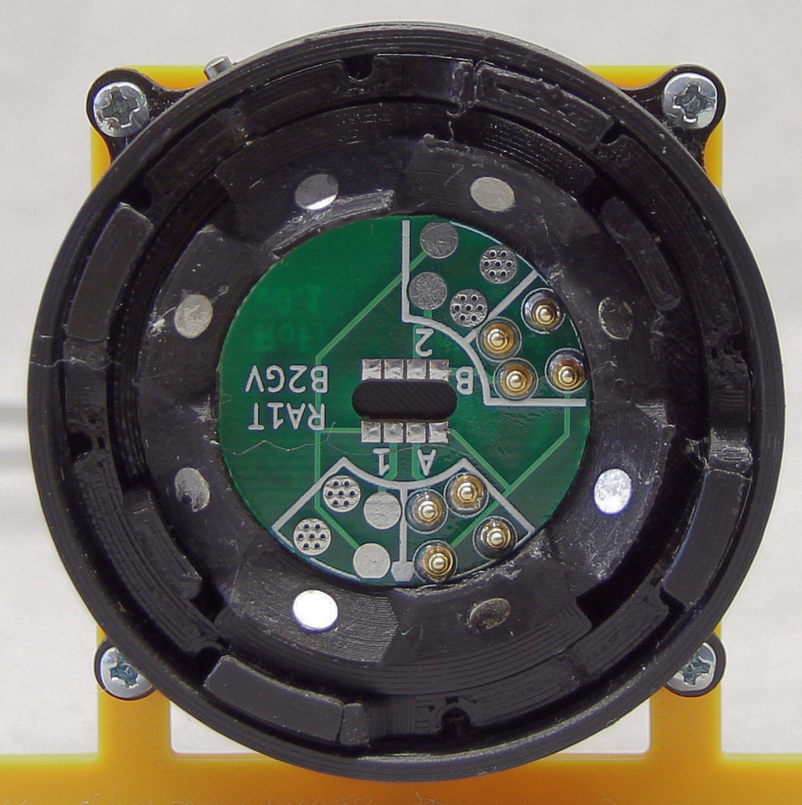
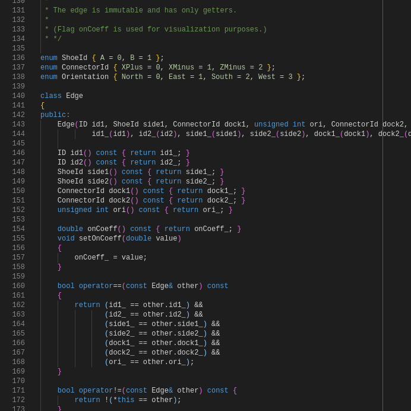

RoFI - Technical Documentation
==============================

This document provides the technical documentation for the `RoFI Platform
<https://ro.fi.muni.cz>`_. Start by selecting the topic:

==================  ===================  ==================
|RoFICoM|_          |Universal Module|_  |RoFI Library|_
------------------  -------------------  ------------------
`RoFICoM`_          `Universal Module`_  `RoFI Library`_
==================  ===================  ==================

.. _RoFICoM: roficom/

.. |Universal Module| image:: _static/um_photo.jpg
.. _Universal Module: universalModule/index

.. _RoFI Library: rofilib/index.html

Note that you can preview the development version of the documentation on
``https://paradise-fi.github.io/RoFI/branch/<git_branch_name>``.

.. toctree::
   :maxdepth: 2
   :caption: Contents:

   roficom/index
   rofilib/index
   universalModule/index
   rofisim/index
