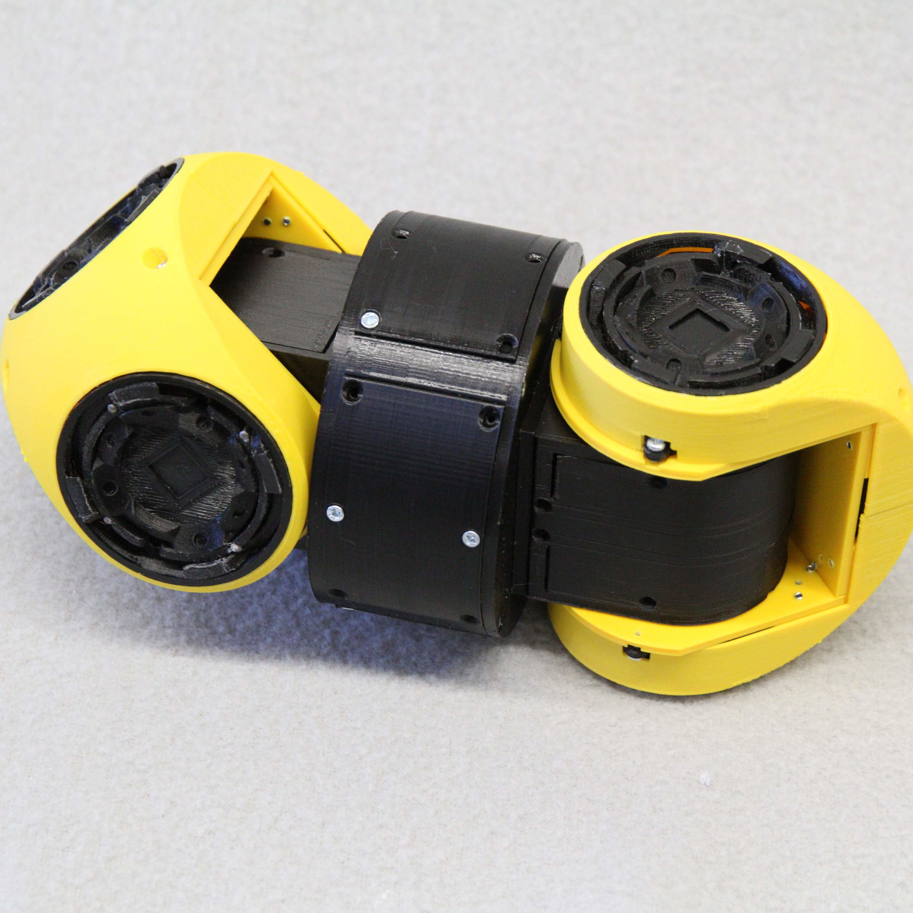

RoFI — Technical Documentation
==============================

This document provides the technical documentation for the `RoFI Platform
<https://ro.fi.muni.cz>`_. Start by selecting the topic:

.. table::
   :widths: 33 33 33

   ===================  =======================  ===================
   |Getting Started|_   |Release engineering|_   |RoFI HAL|_
   -------------------  -----------------------  -------------------
   `Getting Started`_   `Release engineering`_   `RoFI HAL`_
   -------------------  -----------------------  -------------------
   |RoFI Library|_      |RoFICoM|_               |Universal Module|_
   -------------------  -----------------------  -------------------
   `RoFI Library`_      `RoFICoM`_               `Universal Module`_
   ===================  =======================  ===================

.. |Getting Started| image:: _static/code.jpg
.. _Getting Started: intro/

.. |Release engineering| image:: _static/code.jpg
.. _Release engineering: releng/

.. |RoFI HAL| image:: _static/code.jpg
.. _RoFI HAL: rofihal/

.. |RoFI Library| image:: _static/code.jpg
.. _RoFI Library: rofilib/

.. |RoFICoM| image:: _static/connector_photo.jpg
.. _RoFICoM: roficom/

.. _Universal Module: universalModule/

Note that you can preview the development version of the documentation on
``https://paradise-fi.github.io/RoFI/branch/<git_branch_name>``.

.. toctree::
   :caption: Contents:

   intro/index
   releng/index
   tutorials/index
   rofihal/index
   rofilib/index
   roficom/index
   universalModule/index
