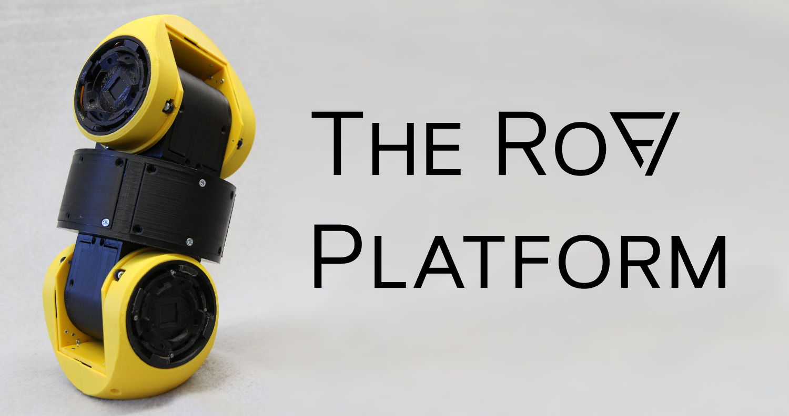

# RoFI - Metamorphic Distributed Robots

RoFI is a platform of modular robots developed at [Faculty of Informatics at
Masaryk University](https://fi.muni.cz/). The platform is designed for building
larger robots (RoFIbots) from a small number of module types.

The modules of the platform can connect together using RoFI dock. Mechanically
connected modules can communicate over TCP/IP and share power.

For an in-depth description of the RoFI platform see related work below.

## Related Work

- [RoFI: Distributed Metamorphic Robots](https://github.com/yaqwsx/mgrthesis) -
  Master's thesis providing the RoFI project overview.

## Repository Structure

The repository is structured in directories according to components of the
project. Each components usually contains two directories: software and
hardware. The hardware directory contains CAD drawings of mechanical
constructions or electronic circuits. The software directory contains
firmware, libraries, etc.

There are following parts of the RoFI project:

- RoFICoM - the self-contained connector mechanism used by modules to connect
  and form a firm mechanical connection and establish communication and
  power-sharing lines.
- Universal module - the foundational module of the platform demonstrating the
  capabilities of the platform.

## Licensing

See [licensing information](licence.md).

