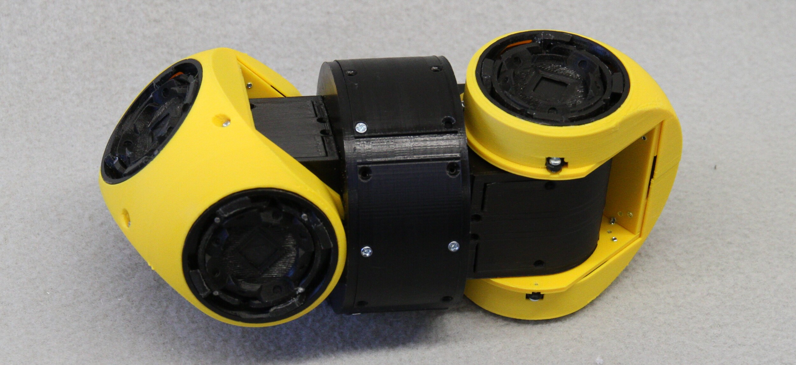

# Universal module

The universal module is supposed to be the primary building block of RoFI
systems. It should provide enough versatility to build a broad range of systems.

To learn more about the module, visit [its
website](https://rofi.fi.muni.cz/hardware/universal-module/)

## Sources Organization

There are two directories:

- `hardware`: contains all the CAD files (Fusion 360 format),PCBs (KiCAD
  format) and other related to the universal module
- `software`: contains the firmware for the control board and RoFIDriver - a
  library linked to all user programs, which implements networking and hardware
  abstraction.

